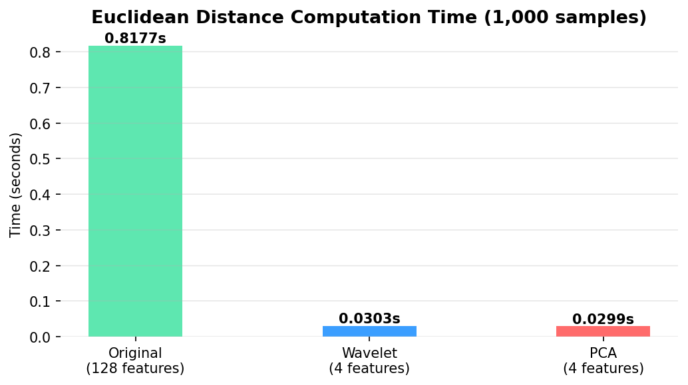
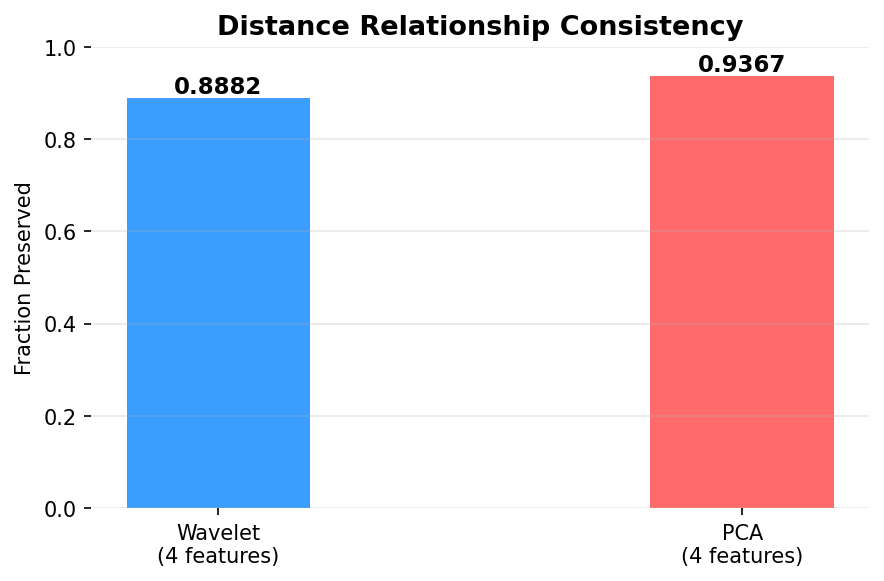
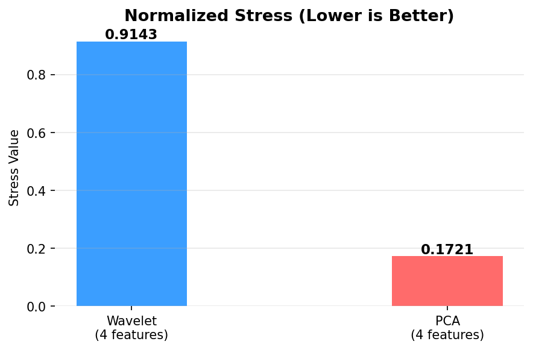

# Dimensionality Reduction: Haar Wavelet Transform vs PCA

Implementation and comparison of two dimensionality reduction techniques — Haar Wavelet Transform and PCA — applied to a dataset of 16,000 samples with 128 features, reduced to 4 features.

## Data
Download and unzip `data.zip`, then place `data.txt` inside a `data/` folder before running the notebook.

## How to Run
1. Create a virtual environment: `python -m venv venv`
2. Activate it: `venv\Scripts\activate` (Windows) or `source venv/bin/activate` (Mac/Linux)
3. Install dependencies: `pip install -r requirements.txt`
4. Place `Asgmnt1_data.txt` inside a `data/` folder
5. Run: `jupyter notebook dimensionality_reduction.ipynb`

## Results

### Elapsed Time (1,000 samples)
| Space | Time | Speedup vs Original |
|---|---|---|
| Original (128 features) | 0.9723s | 1x |
| Wavelet (4 features) | 0.0367s | 26.5x |
| PCA (4 features) | 0.0340s | 28.6x |

### Distance Relationship Consistency
| Technique | Consistency |
|---|---|
| Wavelet | 88.82% |
| PCA | **93.67%** |

### Normalized Stress
| Technique | Stress (lower is better) |
|---|---|
| Wavelet | 0.9143 |
| PCA | **0.1721** |

PCA preserves distances significantly better than Wavelet Transform across both consistency and stress metrics. Both techniques offer a 26-28x speedup in distance computation compared to the original 128-feature space.
